# DIALOG_FLOW.md — Блок-схема диалога и голосового общения с UI

> Документ описывает актуальное состояние кода на момент составления.
> Источник истины — код узлов и фронтенда (см. раздел «Источники»).
> Диаграммы используют Mermaid (`sequenceDiagram`, `stateDiagram-v2`, `flowchart`); текстовые сценарии даны как дополнение к каждой диаграмме.

---

## 1. Краткое описание архитектуры

Диалоговый kiosk Verter — это голосовой интерфейс «нажал кнопку → задал вопрос голосом → получил ответ голосом и на экране». Диалог начинается **только кнопкой** на экране (голосовой триггер «вертер» убран). Ввод — только голос через микрофон робота (STT); на экране только кнопки «Начать диалог» / «Остановить».

### Участники

| Компонент | Реализация | Роль |
|---|---|---|
| **STT** (`speech_to_text_node`) | Python, Sherpa-ONNX CTC + Silero VAD | Захват аудио с ReSpeaker, VAD, распознавание речи → текст. Управляется флагом `is_active` (по умолчанию `False`). |
| **recognition** (`recognition_node`) | Python, FSM | Мозг диалога: FSM из 4 состояний, таймауты, эхоподавление, стоп-последовательность, публикация статусов для UI. |
| **AI** (`ai_assistant_node`) | Python, YandexGPT через OpenAI SDK + Vector Store | Обработка вопроса в отдельном daemon-потоке, таймаут `AI_REQUEST_TIMEOUT=60`с, типизированные ошибки. |
| **TTS** (`silero_tts_node`) | Python, Silero v5_5_ru | Синтез речи + воспроизведение через sounddevice. Сигнализирует начало/конец речи топиком `tts_control`. |
| **UI** (React/TS фронтенд) | DialogPage + dialogStore + useDialogROS | Подписывается на `dialog_status` / `ai_question` / `text_to_speech`, публикует `ui_dialog_control`. Аватар с 5 анимациями, одно текущее сообщение, крупные кнопки. |
| **rosbridge** | rosbridge_server (WebSocket :9090) | Мост между ROS2 топиками и браузером. Тихий реконнект при разрыве. |

### Поток данных (топики)

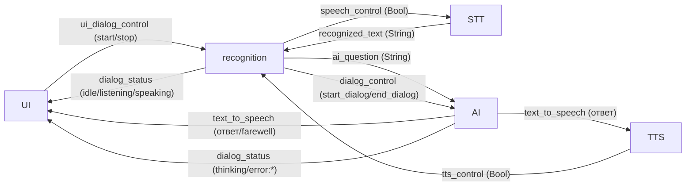

### QoS где важно

- `/speech_control` — **TRANSIENT_LOCAL** (latched) + RELIABLE, depth 10. Поздний STT-подписчик получает последнее значение при подключении. Стартовое `speech_control=False` (STT выключен в idle) не теряется из-за гонки DDS-discovery.
- Все остальные топики диалога — **RELIABLE, VOLATILE, depth 10** (стандартный профиль).
- `/tts_control` — VOLATILE, depth 10 (события начала/конца речи; latched не нужен).

---

## 2. Happy path — полный диалог

Кнопка «Начать» → вопрос → «думаю» → ответ (TTS) → слушаем следующий → ... → 30с тишины → idle.

### Диаграмма

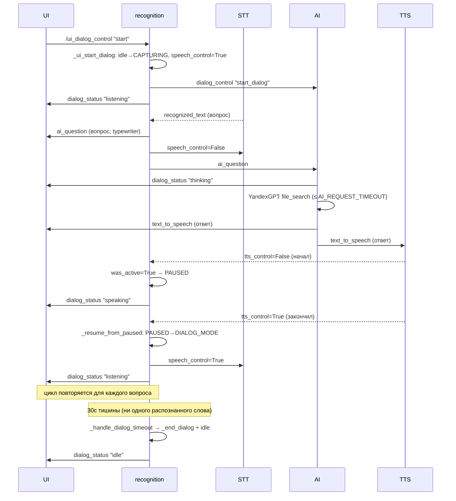

### Пошаговый сценарий

1. **idle**: экран показывает welcome «Привет! Нажми на кнопку чтобы начать диалог!», аватар `breathe`, кнопка «Начать диалог».
2. Пользователь нажимает «Начать» → UI публикует `/ui_dialog_control "start"`.
3. `recognition._ui_start_dialog()`: состояние `idle→CAPTURING_COMMAND`, `speech_control=True` (STT вкл), `dialog_control "start_dialog"` → AI (`dialog_active=True`, сброс контекста), `dialog_status "listening"`, запуск `command_timeout` (10с).
4. UI: аватар `listening`, кнопка «Остановить».
5. Пользователь говорит вопрос. STT (VAD + ASR) распознаёт текст → `/recognized_text`.
6. `recognition._handle_recognized_speech()`: стоп-команда? нет → `CAPTURING→DIALOG_MODE`, `ai_question` публикуется (UI: вопрос typewriter), `speech_control=False` (деактивация STT), таймеры остановлены.
7. `ai_assistant` получает `ai_question` в daemon-потоке: проверка `dialog_active` → `dialog_status "thinking"` (UI: аватар `thinking`).
8. YandexGPT + file_search формирует ответ. Перед публикацией — повторная проверка `dialog_active`.
9. AI публикует ответ в `/text_to_speech` (UI: ответ typewriter; TTS: синтез + воспроизведение).
10. TTS: `tts_control=False` (начал) → recognition: `was_active=True` → `PAUSED`, `dialog_status "speaking"` (UI: аватар `говорит`).
11. TTS: `tts_control=True` (закончил) → `_resume_from_paused`: `PAUSED→DIALOG_MODE`, `speech_control=True`, `dialog_status "listening"`, сброс `dialog_timeout` (30с).
12. **Цикл**: повтор с шага 5 для следующего вопроса.
13. **30с тишины**: `_handle_dialog_timeout` → `fail_timeout.wav`, `_end_dialog` (`dialog_control "end_dialog"` → AI), `speech_control=False`, `dialog_status "idle"`.
14. UI: welcome, аватар `breathe`, кнопка «Начать диалог».

---

## 3. Таблица состояний FSM recognition

FSM `RecognitionState` управляется классом `StateManager` внутри `recognition_node`.

| Состояние | Что делает | Активные топики (pub) | Активные таймеры | Переходы куда |
|---|---|---|---|---|
| **LISTENING_FOR_TRIGGER** (idle) | Пассивное ожидание. STT выключен. Распознанный текст игнорируется (гард). | `dialog_status "idle"`, `speech_control False` | нет | → CAPTURING_COMMAND (по `ui_dialog_control "start"`) |
| **CAPTURING_COMMAND** | Слушаем первый вопрос после нажатия кнопки. STT включён. | `dialog_status "listening"`, `speech_control True`, `dialog_control "start_dialog"` | `command_timeout` (10с) | → DIALOG_MODE (распознан валидный текст) → LISTENING_FOR_TRIGGER (stop / command_timeout) → PAUSED (TTS начал говорить) |
| **DIALOG_MODE** | Активный диалог: слушаем следующий вопрос. STT включён. | `dialog_status "listening"`, `speech_control True` | `dialog_timeout` (30с, сбрасывается на каждый ответ/вопрос) | → PAUSED (TTS начал говорить) → LISTENING_FOR_TRIGGER (stop / dialog_timeout / стоп-команда голосом) |
| **PAUSED** | TTS говорит — STT выключен, распознанный текст игнорируется. Запоминается previous_state. | `dialog_status "speaking"`, `speech_control False` | нет | → previous_state (TTS закончил) → LISTENING_FOR_TRIGGER (stop) |

### Диаграмма переходов FSM

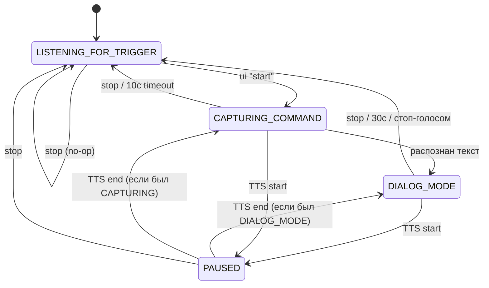

---

## 4. Corner cases

### 4.1. Стоп во время thinking

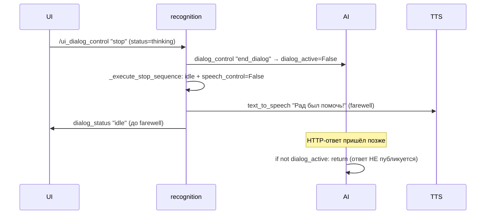

**Пошагово:**
1. Пользователь нажимает «Остановить» во время `thinking` → `/ui_dialog_control "stop"`.
2. `_execute_stop_sequence`: `dialog_status "idle"` + `speech_control=False` + `_end_dialog(with_farewell=True)` → `dialog_control "end_dialog"` в AI (`dialog_active=False`) + farewell в `text_to_speech`.
3. UI: `idle`, welcome.
4. TTS озвучивает farewell; т.к. state уже `idle` → `was_active=False` → НЕ `speaking`, STT НЕ вкл.
5. HTTP-ответ YandexGPT приходит позже → `if not self.dialog_active: return` → ответ отбрасывается.

**Инвариант:** `dialog_active` проверяется **дважды** — перед публикацией `thinking` и перед публикацией ответа. Стоп устанавливает `dialog_active=False` синхронно (через `dialog_control_callback` в executor-потоке rclpy). Проверка выполняется без блокировки; окно гонки между чтением `dialog_active` и публикацией ответа ничтожно мало, последствие — лишь лёгкий UX-дефект (ответ озвучится после «Рад был помочь!»), не safety-проблема. `dialog_active` сохранён как минимальный инвариант.

---

### 4.2. Стоп во время speaking

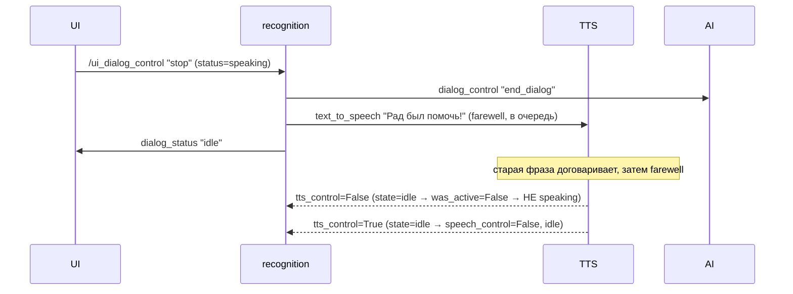

**Пошагово:**
1. «Остановить» во время `speaking` → `_execute_stop_sequence`: `idle` + `speech_control=False` + `_end_dialog(with_farewell=True)` (farewell в `text_to_speech`, `end_dialog` в AI), `stop_all_timers`.
2. UI: `idle`, welcome.
3. TTS не прерывает текущее воспроизведение мгновенно — farewell встаёт в очередь (`_pending_text`), старая фраза договаривается, затем озвучивается farewell.
4. `tts_control=False`: state уже `idle` → `was_active=False` → НЕ `speaking`.
5. `tts_control=True`: state `idle` → `speech_control=False`, `dialog_status "idle"`.

**Особенность:** `was_active=False` (state уже idle) предотвращает повторный переход в speaking.

---

### 4.3. Стоп в CAPTURING_COMMAND (до первого вопроса)

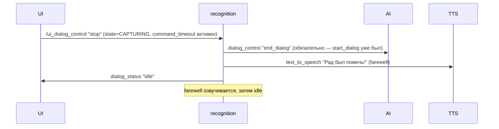

**Пошагово:**
1. «Остановить» в `CAPTURING_COMMAND` (до первого вопроса) → `_execute_stop_sequence`: `idle` + `speech_control=False` + `_end_dialog(with_farewell=True)`, `stop_all_timers`.
2. UI: `idle`, welcome.

**Ключевой нюанс:** `start_dialog` уже был отправлен в AI при нажатии «Начать», поэтому `dialog_active=True`. Стоп в CAPTURING **обязательно** шлёт `end_dialog`, иначе `dialog_active` в AI зависнет в `True`.

---

### 4.4. Таймаут AI (error:timeout + грустная анимация)

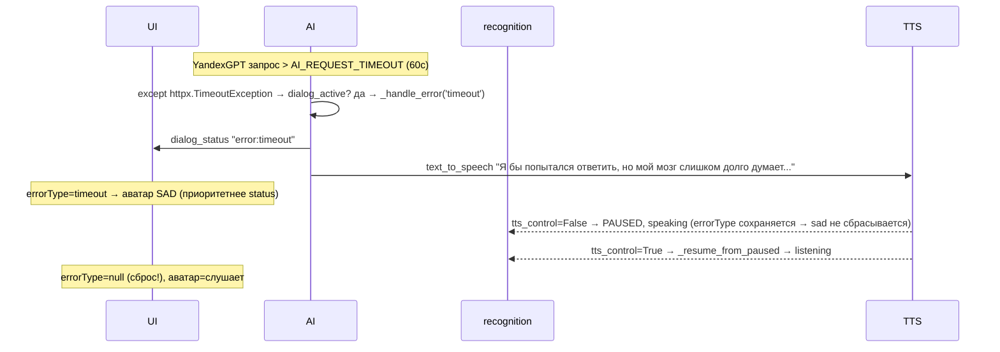

**Пошагово:**
1. `thinking` → YandexGPT запрос превышает `AI_REQUEST_TIMEOUT` (60с) → `httpx.TimeoutException`.
2. AI: `dialog_active?` да → `_handle_error('timeout')` → `dialog_status "error:timeout"` + дружелюбный текст в `text_to_speech`.
3. UI: `errorType=timeout`, аватар `sad` (приоритетнее `status`).
4. TTS озвучивает текст ошибки → `tts_control=False` → `was_active=True` → `PAUSED`, `speaking` (`errorType` сохраняется → аватар остаётся грустным).
5. `tts_control=True` → `_resume_from_paused` → `speech_control=True`, `dialog_status "listening"`.
6. UI: `errorType=null` (сброс!), аватар `слушает`, кнопка «Остановить».

**Важно:** ошибка «прилипает» к аватару. `errorType` сбрасывается **только** при переходе в `listening` или `idle` (логика в `dialogStore.setStatus`). Пока TTS озвучивает ошибку (`speaking`), `errorType` сохраняется → аватар грустный.

---

### 4.5. Нет сети (error:network)

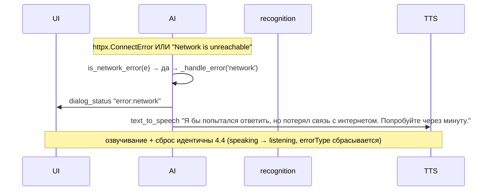

**Пошагово:**
1. `thinking` → сетевая ошибка (`httpx.ConnectError` или сообщение содержит `"Network is unreachable"`).
2. AI: `is_network_error(e)` → да → `_handle_error('network')` → `dialog_status "error:network"` + текст ошибки.
3. UI: `errorType=network`, аватар `sad`.
4. TTS озвучивает → `speaking` → `listening` (как в 4.4, `errorType` сбрасывается).

**Отличие от timeout:** тип ошибки `network` → другой текст. Механизм озвучивания и сброса идентичен. Общий `except Exception` классифицирует ошибку через `is_network_error(e)` (модульная функция уровня модуля, проверяет `"Network is unreachable"` / `"ConnectError"`) → `network`, иначе `unavailable`. Та же `is_network_error` используется в `_get_or_create_vector_store`.

---

### 4.6. Тишина 10с (command_timeout) и 30с (dialog_timeout)

#### 4.6a. command_timeout (10с, в CAPTURING_COMMAND)

Пользователь нажал «Начать», но не задал вопрос за 10 секунд.

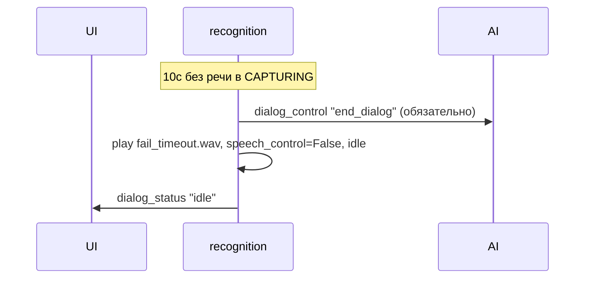

**Особенность:** `command_timeout` срабатывает в `CAPTURING_COMMAND` (до первого вопроса). `start_dialog` уже был отправлен в AI → обязательно шлём `end_dialog`. Нет farewell (только звуковой сигнал `fail_timeout.wav`).

#### 4.6b. dialog_timeout (30с, в DIALOG_MODE)

После ответа робот ждёт следующий вопрос 30 секунд.

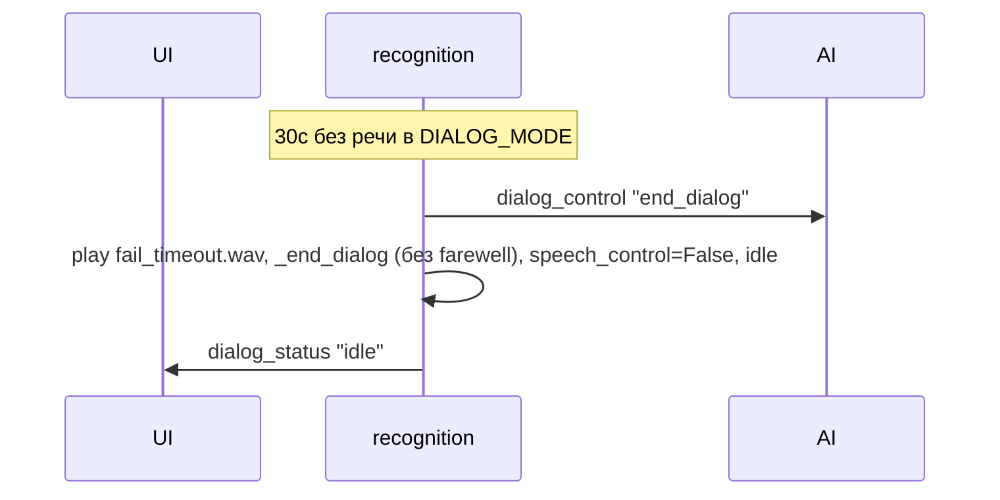

**Отличие:** `dialog_timeout` вызывает `_end_dialog()` (без farewell, только звук). `dialog_active` в AI сбрасывается через `end_dialog`.

---

### 4.7. TTS упал посередине — известное ограничение (без watchdog)

> Watchdog на `tts_control` удалён как избыточный (TTS-узел считается достаточно надёжным; в normal path его `try/finally` всегда публикует `tts_control=True`). Раздел оставлен как документация известного corner case.

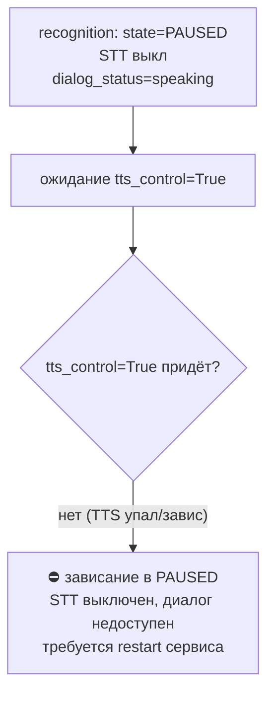

**Сценарий:** TTS начал говорить (`tts_control=False` → recognition → PAUSED), но `tts_control=True` (конец речи) так и не пришёл — TTS-узел упал/завис/killed посередине синтеза.

**Последствие:** recognition остаётся в PAUSED неограниченно долго — STT выключен, `dialog_status` застывает на `speaking`, кнопка «Начать» блокируется гардом состояния. Пользователь вынужден перезапустить сервис (`systemctl --user restart verter-admin`).

**Почему принятое решение (удалить watchdog):**
- Нормальный путь TTS всегда завершается `tts_control=True` через `try/finally` в `_synthesize_and_play` и `_speak_loop`.
- Падение процесса TTS означает падение всей ноды → systemd `Restart=always` поднимает её заново (а с ней и recognition через тот же сервис), поэтому «вечный PAUSED» на практике эквивалентен рестарту.
- Watchdog добавлял ~50 строк и собственный баг (периодический таймер не самоостанавливался после срабатывания → диалог не таймаутился после восстановления). Стоимость поддержки превышала ценность для kiosk-сценария.

**Mitigation (внешние):** systemd `Restart=always` на `verter-admin.service`; ручной `systemctl --user restart verter-admin`. При необходимости восстановить устойчивость — вернуть watchdog как one-shot `threading.Timer` (не периодический), см. историю git.

---

### 4.8. Кнопка «Начать» во время farewell

```mermaid
sequenceDiagram
    participant UI
    participant REC as recognition
    participant TTS
    Note over REC: state=LISTENING (idle),<br/>farewell озвучивается TTS,<br/>was_active=False → НЕ PAUSED
    UI->>REC: /ui_dialog_control "start"
    REC->>REC: _ui_start_dialog: state не в {DIALOG,CAPTURING,PAUSED} → РАЗРЕШАЕТ старт
    REC->>AI: dialog_control "start_dialog"
    REC->>UI: dialog_status "listening"
    Note over REC,TTS: TTS договаривает farewell; tts_control=True позже → was_active=True → возможен кратковременный speaking
```

**Пошагово:**
1. `idle`, TTS озвучивает farewell; state=`LISTENING_FOR_TRIGGER` → `was_active=False` → НЕ перешёл в PAUSED.
2. Пользователь нажимает «Начать» → `/ui_dialog_control "start"`.
3. `_ui_start_dialog`: state не в `{DIALOG_MODE, CAPTURING_COMMAND, PAUSED}` → **разрешает** старт → `CAPTURING_COMMAND`, `speech_control=True`, `start_dialog` в AI, `dialog_status "listening"`, `command_timeout` (10с).

**Ключевой нюанс:** farewell в idle **не переводит** state в PAUSED (`was_active=False`). Поэтому гард `_ui_start_dialog` **пропускает** старт — кнопка «Начать» доступна во время farewell. Если `tts_control=True` придёт позже, recognition уже в активном состоянии → `was_active=True` → возможен кратковременный `speaking`. Это известный компромисс: блокировать кнопку на всё время farewell было бы хуже для UX.

---

### 4.9. rosbridge реконнект (тихий)

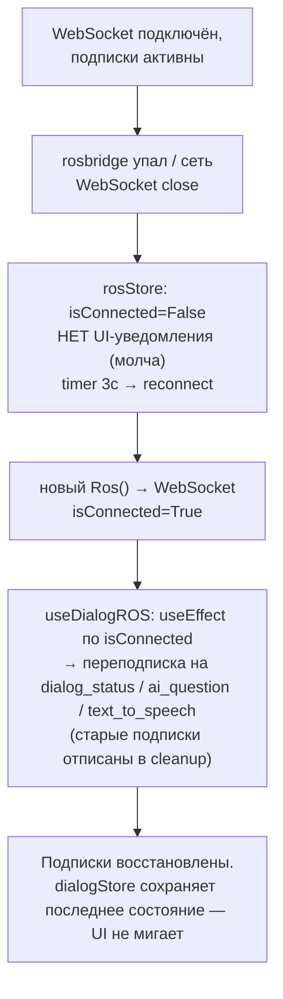

**Тихий реконнект:** `rosStore.isConnected` меняется, `useDialogROS` переподписывается через `useEffect([isConnected])`. `dialogStore` не сбрасывается — на экране остаётся последнее сообщение и статус. Пользователь не видит ошибки.

---

## 5. Таблица топиков

| Топик | Тип сообщения | QoS | Издатель(и) | Подписчик(и) | Назначение |
|---|---|---|---|---|---|
| `/dialog_status` | `std_msgs/String` | RELIABLE, VOLATILE, depth 10 | recognition (`idle`/`listening`/`speaking`), AI (`thinking`/`error:timeout`/`error:network`/`error:unavailable`) | UI (фронтенд) | Единый источник правды для статуса диалога → анимация аватара, сообщение, кнопка |
| `/ui_dialog_control` | `std_msgs/String` (`"start"` / `"stop"`) | RELIABLE, VOLATILE, depth 10 | UI (фронтенд) | recognition | Управление диалогом с экранной кнопки |
| `/dialog_control` | `std_msgs/String` (`"start_dialog"` / `"end_dialog"`) | RELIABLE, VOLATILE, depth 10 | recognition | AI | Управление `dialog_active` в AI (сброс контекста, блокировка ответа после стопа) |
| `/ai_question` | `std_msgs/String` | RELIABLE, VOLATILE, depth 10 | recognition | AI, UI | Вопрос пользователя → AI (обработка) и UI (отображение) |
| `/text_to_speech` | `std_msgs/String` | RELIABLE, VOLATILE, depth 10 | AI (ответ), recognition (farewell) | TTS (синтез), UI (отображение) | Текст для озвучивания и показа на экране |
| `/tts_control` | `std_msgs/Bool` (`False`=начал, `True`=закончил) | RELIABLE, VOLATILE, depth 10 | TTS | recognition, STT | Эхоподавление: TTS начал → STT выкл + recognition→PAUSED; TTS закончил → `_resume_from_paused` (STT вкл по контексту, PAUSED→active). Без watchdog (см. 4.7) |
| `/speech_control` | `std_msgs/Bool` | **RELIABLE, TRANSIENT_LOCAL**, depth 10 | recognition | STT | Включение/выключение микрофона. Latched: поздний STT-подписчик получает последнее значение |
| `/recognized_text` | `std_msgs/String` | RELIABLE, VOLATILE, depth 10 | STT | recognition | Распознанный текст речи пользователя |
| `/play` | `std_msgs/String` | RELIABLE, VOLATILE, depth 10 | recognition | sound_player_node | Звуковые эффекты (`success.wav`, `fail_timeout.wav`) |

---

## 6. Карта статусов dialog_status → UI

Значение `dialog_status` (String) → `parseDialogStatus()` в `types/dialog.ts` → `dialogStore` → отображение.

| Значение `dialog_status` | Нормализованный статус | `errorType` | Анимация аватара (`data-avatar`) | MessageZone | Кнопка |
|---|---|---|---|---|---|
| `"idle"` | `idle` | `null` | `idle` (breathe — плавное дыхание) | `welcome`: «Привет! Нажми на кнопку чтобы начать диалог!» | «Начать диалог» (accent) |
| `"listening"` | `listening` | `null` (сброс ошибки) | `listening` (пульсация/анимация слушания) | последнее сообщение (question/answer, fade) | «Остановить» (danger) |
| `"thinking"` | `thinking` | `null` (сохраняется если был) | `thinking` (крутится/думает) | последнее сообщение (question, typewriter) | «Остановить» (danger) |
| `"speaking"` | `speaking` | `null` (сохраняется если был) | `speaking` (говорит) | ответ/farewell/error (typewriter) | «Остановить» (danger) |
| `"error:timeout"` | `error` | `timeout` | `sad` (грустный — **приоритетнее status**) | «Я бы попытался ответить, но мой мозг слишком долго думает. Может, попробуете ещё раз?» | «Остановить» (danger) |
| `"error:network"` | `error` | `network` | `sad` | «Я бы попытался ответить, но потерял связь с интернетом. Попробуйте через минуту.» | «Остановить» (danger) |
| `"error:unavailable"` | `error` | `unavailable` | `sad` | «Я бы попытался ответить, но мой мозг не отвечает. Может, попробуете ещё раз?» | «Остановить» (danger) |

### Логика «прилипания» ошибки

`errorType` «прилипает» к аватару до `listening`/`idle`:

| `dialog_status` | `errorType` | аватар | почему |
|---|---|---|---|
| `thinking` | `null` | `thinking` | нормальный путь |
| `error:timeout` | `timeout` | `sad` | ошибка |
| `speaking` | `timeout` | `sad` | TTS озвучивает ошибку, `errorType` сохраняется (не `listening`/`idle`) |
| `listening` | `null` (сброс!) | `listening` | `errorType` сбрасывается → sad уходит |

`RobotAvatar`: `avatarState = errorType ? 'sad' : status`. Пока `errorType != null`, аватар — грустный, независимо от `status`. `errorType` сбрасывается в `dialogStore.setStatus` **только** при `status === 'listening' || status === 'idle'`.

### Логика роли сообщения в MessageZone

Роль определяется в `useDialogROS.subscribeTextToSpeech` по текущему `errorType` и `status`:

| Условие | Роль | Анимация появления |
|---|---|---|
| `errorType != null` | `error` | typewriter |
| `status === 'idle'` | `farewell` | fade (не typewriter) |
| иначе (thinking/listening/speaking) | `answer` | typewriter |

Для `ai_question` — всегда роль `question` (typewriter).

Длительность typewriter: `Math.min(Math.max(text.length * 45, 800), 6000)` мс (≈45 мс/символ, 0.8–6.0с).

---

## 7. Источники (код)

| Файл | Что содержит |
|---|---|
| `src/verter_admin/recognition/recognition_node.py` | FSM диалога, таймауты, эхоподавление, стоп-последовательность, публикация статусов |
| `src/verter_admin/ai_assistant/ai_assistant_node.py` | YandexGPT, таймаут `AI_REQUEST_TIMEOUT=60`с, `dialog_active` проверяется без lock (3 точки: перед thinking/ответом/в error), типизированные ошибки через `is_network_error` |
| `src/verter_admin/speech_to_text/speech_to_text_node.py` | STT, `is_active` (по умолчанию `False`), подписка на `speech_control` (TRANSIENT_LOCAL) и `tts_control` |
| `src/verter_admin/text_to_speech/silero_tts_node.py` | TTS Silero, публикация `tts_control` (False=начал, True=закончил), очередь `_pending_text` |
| `src/verter_admin/web/frontend/src/hooks/useDialogROS.ts` | Подписки `dialog_status`/`ai_question`/`text_to_speech`, публикация `ui_dialog_control`, определение роли по статусу |
| `src/verter_admin/web/frontend/src/store/dialogStore.ts` | Zustand store: `status`, `errorType`, `currentMessage`, логика прилипания ошибки и сброса welcome |
| `src/verter_admin/web/frontend/src/types/dialog.ts` | `parseDialogStatus()`, типы `DialogStatus`/`ErrorType`/`MessageRole` |
| `src/verter_admin/web/frontend/src/pages/dialog/DialogPage.tsx` | Композиция экрана: аватар / сообщение / кнопки |
| `src/verter_admin/web/frontend/src/components/dialog/RobotAvatar.tsx` | CSS-only аватар, `avatarState = errorType ? 'sad' : status` |
| `src/verter_admin/web/frontend/src/components/dialog/MessageZone.tsx` | Одно сообщение, typewriter для answer/question/error, fade для farewell/welcome |
| `src/verter_admin/web/frontend/src/components/dialog/DialogControls.tsx` | «Начать диалог» / «Остановить» |
| `DIALOG_KIOSK_PLAN.md` | Архитектурные решения (#1–#16), corner cases, тексты ошибок |
